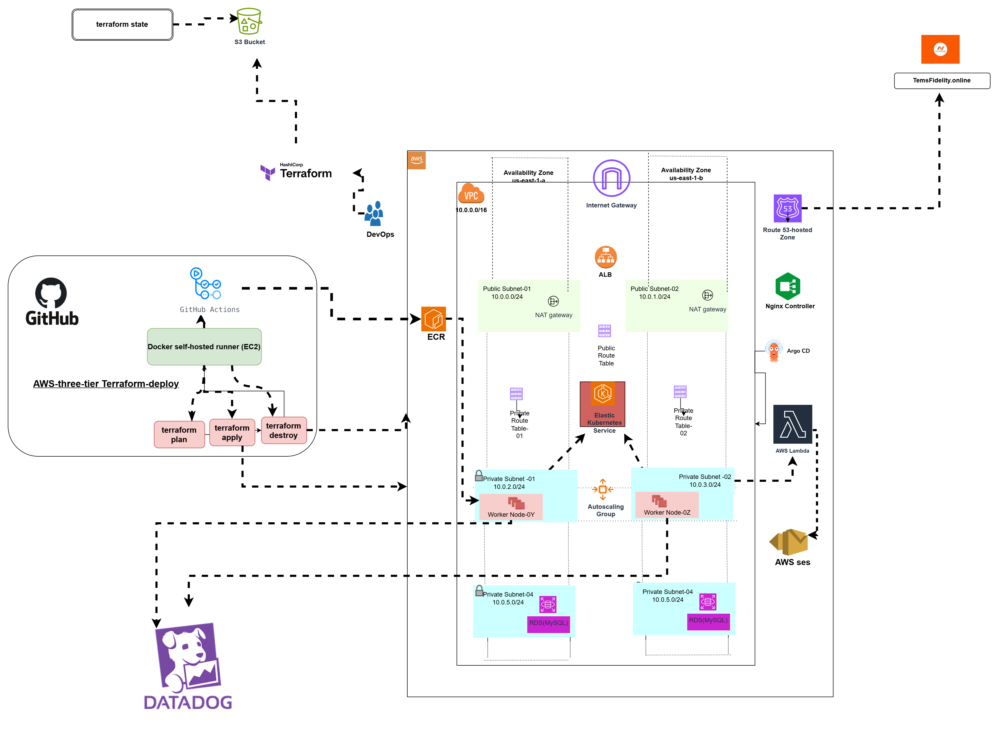
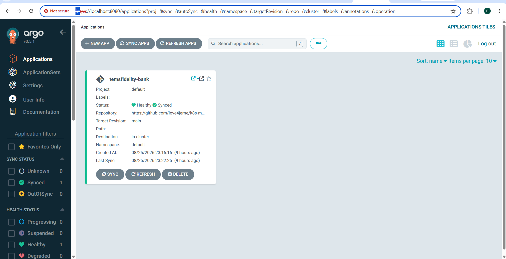
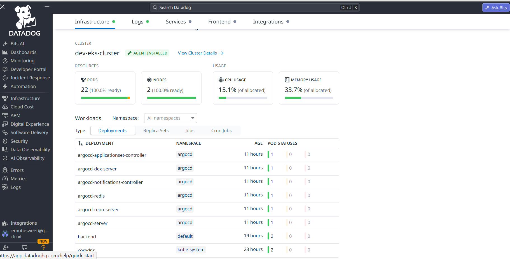
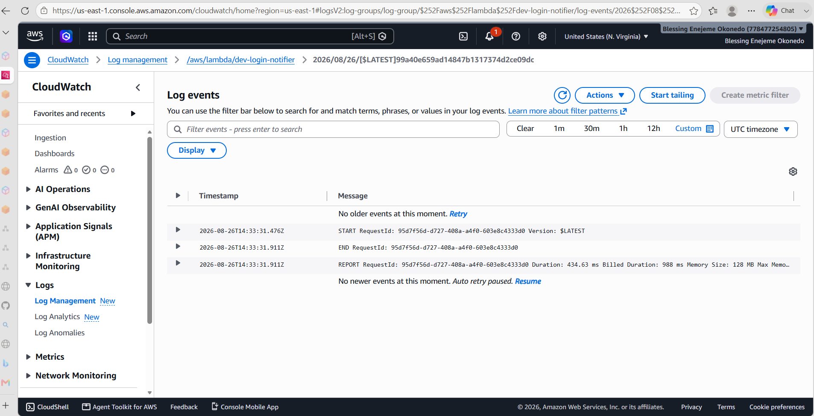
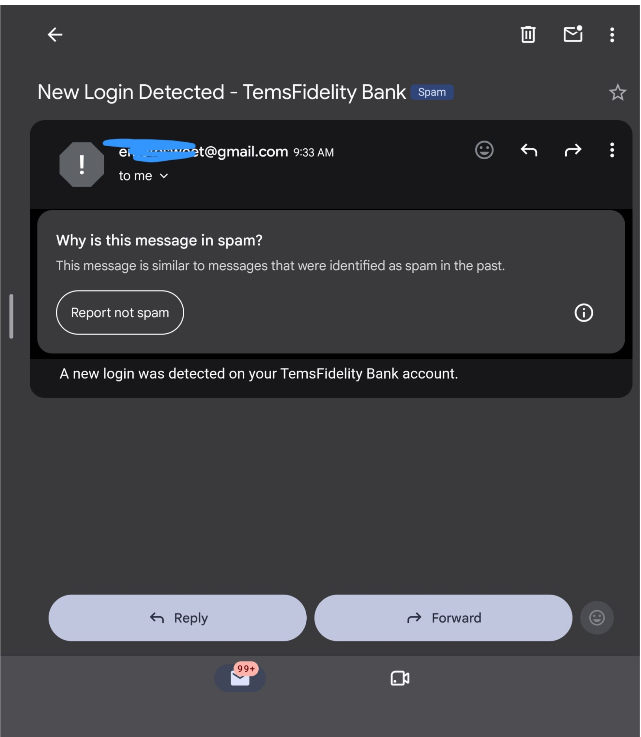
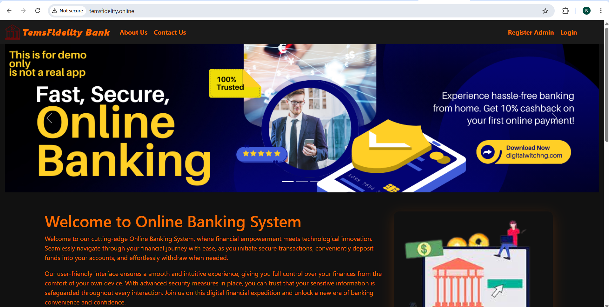
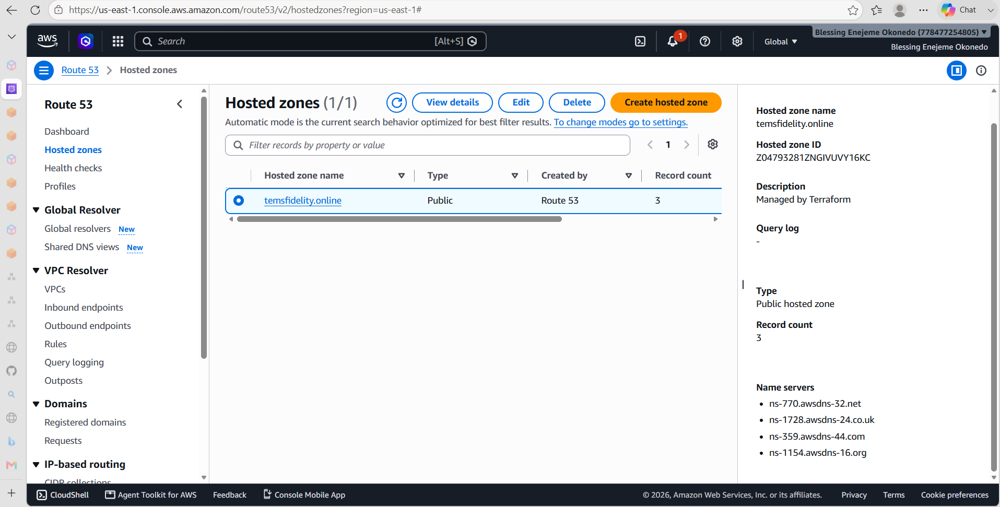

# TemsFidelity Bank — AWS "3-Tier" Cloud Infrastructure Project

A production-style banking application deployed on **AWS EKS**, provisioned entirely with **Terraform**, delivered through **GitOps (ArgoCD)**, monitored with **Datadog**, and wired to **AWS Lambda + SES** for login notifications.

> This is a demo/portfolio project — not a real banking application. No real financial transactions occur.

---

## Live Demo

🔗 [temsfidelity.online](http://temsfidelity.online)

---

## Architecture

**Stack summary:**

| Layer | Technology |
|---|---|
| Compute | Amazon EKS (Kubernetes v1.33), 2 worker nodes across 2 AZs |
| Database | Amazon RDS for MySQL 8.0, **Multi-AZ** enabled |
| Networking | Custom VPC, public/private subnets, NAT Gateways, ALB, Route53 |
| Container Registry | Amazon ECR |
| GitOps / CD | ArgoCD, synced from a dedicated Kubernetes manifests repo |
| Ingress | Nginx Ingress Controller |
| Observability | Datadog (Infrastructure, APM, Log Management) |
| Serverless | AWS Lambda (login notifier) → Amazon SES |
| IaC | Terraform, remote state in S3 + DynamoDB locking |
| CI/CD | GitHub Actions, self-hosted runner (EC2) |

Designed before provisioning began, then built to match — including a Multi-AZ RDS instance from the start.

---

## What This Project Demonstrates

- **Infrastructure as Code** — full environment (42 AWS resources: VPC, EKS, RDS, ECR, Lambda, Route53, security groups) provisioned and destroyed via Terraform, with remote state management (S3 + DynamoDB locking).
- **GitOps delivery** — ArgoCD continuously syncing application state from Git, not manual `kubectl apply`.
- **Real observability** — Datadog Agent deployed as a DaemonSet across the cluster, with Infrastructure Monitoring, Application Performance Monitoring (APM), and Log Management enabled and verified against live traffic.
- **Event-driven notifications** — a Spring Boot backend triggering a containerized Lambda function on login, which sends a real email via SES.
- **Debugging under real conditions** — this project involved genuine production-style incidents that were diagnosed and resolved (see below), not just a clean happy-path deploy.

---

## Debugging Highlights

Real infrastructure comes with real problems. A few worth calling out:

**1. ArgoCD `ApplicationSet` controller stuck in `CrashLoopBackOff` for 11+ hours (96 restarts)**
Root cause: the `applicationsets.argoproj.io` CRD was missing from the cluster (ArgoCD was installed via a partial manifest set rather than the full official bundle). Diagnosed via `kubectl logs --previous`, fixed by server-side-applying the official ArgoCD CRDs (`kubectl apply --server-side -k ".../argo-cd/manifests/crds?ref=stable"` — a standard `kubectl apply` failed on CRD annotation size limits), then recycling the pod.

**2. Datadog Agent stuck at partial readiness**
Installed via the Datadog Operator (`DatadogAgent` v2alpha1 CRD) rather than a raw DaemonSet, scoped APM instrumentation to Java only (matching the Spring Boot backend) instead of injecting five unused language tracers. Verified full `3/3` container readiness on both node agents and a valid, authenticated API key against Datadog's servers.

**3. SES sandbox mode blocking email delivery**
First Lambda invocation failed with `MessageRejected: Email address is not verified`. Diagnosed as SES's default sandbox restriction (requires both sender and recipient verification). Verified both identities, updated the Lambda's `SENDER_EMAIL` environment variable, and confirmed end-to-end delivery — down to checking CloudWatch Logs for the exact execution report (`Duration: 434.63 ms, Billed Duration: 988 ms`).

**4. Clean teardown with dependency ordering**
`terraform destroy` failed twice on resources with live data Terraform won't force-delete: a non-empty Route53 hosted zone (an A record it created but wouldn't auto-remove) and three non-empty ECR repositories. Resolved by explicitly clearing ECR images and deleting the specific Route53 record set before re-running destroy — avoiding the orphaned-load-balancer trap that can block VPC deletion entirely.

---

## Verified Proof

All of the following were captured live during this deployment — not staged.

**ArgoCD — application Healthy & Synced**

**Datadog — live cluster metrics, confirmed API key validity**

**Lambda → SES — successful invocation, real execution report**

**The actual login notification email, delivered**

**Live application, served over the custom domain**

**Route53 — hosted zone, managed by Terraform**

Additionally verified but not pictured: full DNS propagation (`dig` checks against all 4 nameservers), and a clean `terraform destroy` of all 42 resources with zero orphaned billing (confirmed via AWS CLI).

---

## Known Limitations / Next Steps

- Email delivery currently lands in spam — no SPF/DKIM/DMARC records configured yet for the sending domain.
- HTTPS/TLS is not yet configured on the ALB (currently HTTP only).
- APM traces were configured but not exercised against live application traffic in this session — a good next verification step.

---

## Repositories

- Infrastructure (Terraform): `love4jeme/temsfidelitybank`
- Kubernetes manifests (ArgoCD source): `love4jeme/kubernetes-manifest`
- Backend: `love4jeme/main_bank_app_backend`
- Frontend: `love4jeme/main_bank_app_frontend`
